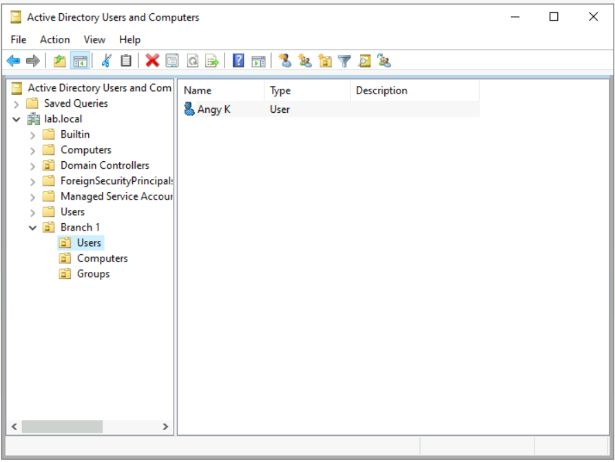
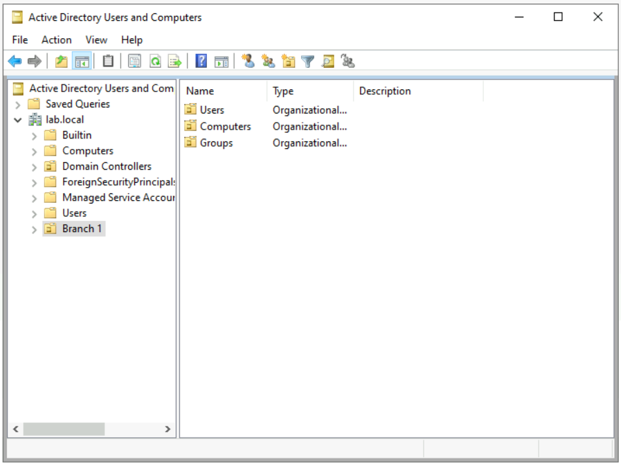

# Create a Domain Controllor in Windows Server (with Active Directory)
## Overview
A hands-on project setting up a Windows Server instance and promoting it to a Domain Controller, then organizing Active Directory with Users, Computers, and Groups.

## Technologies Used
- Windows Server 2022
- Active Directory Domain Services (AD DS)
- Active Directory Users and Computers (ADUC)

## Build Process

### 1. Promoted the server to a Domain Controller

Installed the AD DS role and promoted the server to a domain controller.

### 2. Organized Active Directory structure

Opened Active Directory Users and Computers to manage the domain.

## Organized Active Directory structure
Created a top-level OU named "Branch 1" to simulate an organizational branch, 
under which Users, Computers, and Groups were structured.

### 3.Users OU

Created a Users folder to manage domain user accounts.

### 4. Computers OU

Created a Computers folder to manage domain-joined machines.

### 5. Groups OU

Created a Groups folder to manage security/distribution groups.

## What I Learned
- Learned how to promote a Windows Server to a Domain Controller using AD DS.
- Understood the purpose of Organizational Units (OUs) in structuring Active Directory.
- Practiced organizing domain resources for easier management and delegation.

