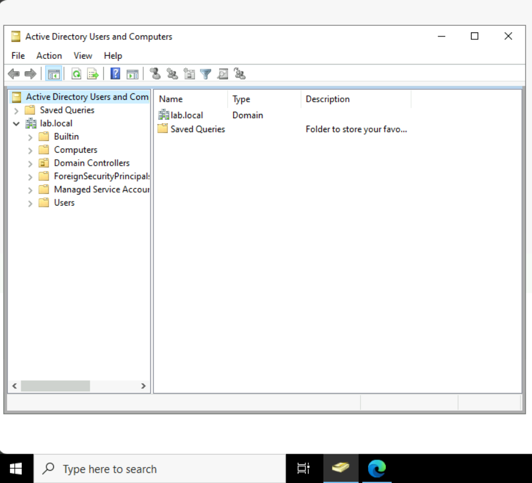

# Create a Domain Controlloer in Windows Server

## Overview
A hands-on project setting up a Windows Server instance and promoting it to a Domain Controller, then organizing Active Directory with Users, Computers, and Groups.

## Technologies Used
- Windows Server 2022
- Active Directory Domain Services (AD DS)
- Active Directory Users and Computers (ADUC)

## Build Process

### 1. Deployed a Windows Server instance

Deployed a Windows Server instance to use as the domain controller.

### 2. Promoted the server to a Domain Controller

Installed the AD DS role and promoted the server to a domain controller.

### 3. Organized Active Directory structure

Opened Active Directory Users and Computers to manage the domain.

Created a Users folder to manage domain user accounts.

Created a Computers folder to manage domain-joined machines.

Created a Groups folder to manage security/distribution groups.

## What I Learned
- Learned how to promote a Windows Server to a Domain Controller using AD DS.
- Understood the purpose of Organizational Units (OUs) in structuring Active Directory.
- Practiced organizing domain resources for easier management and delegation.
