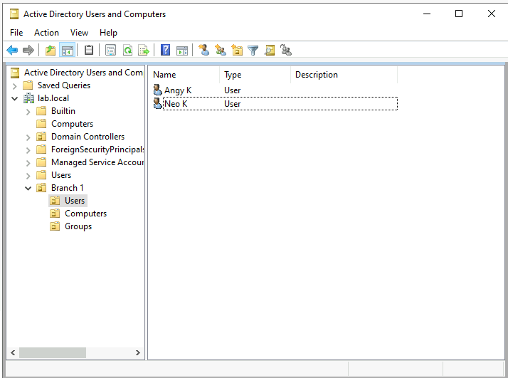
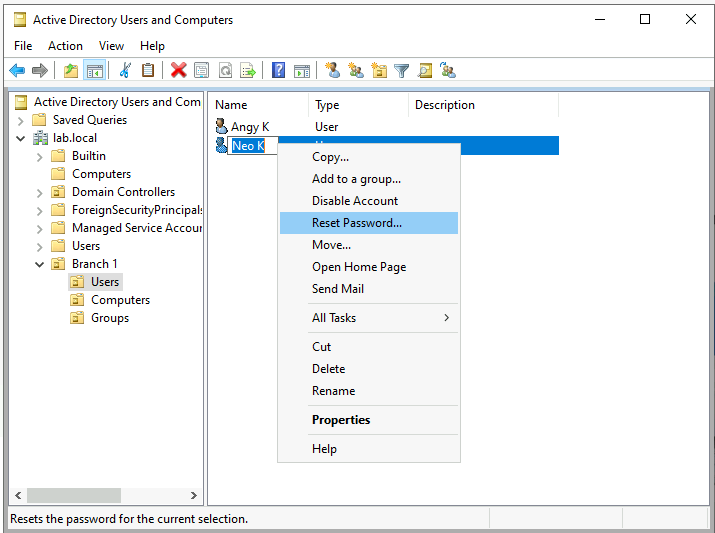
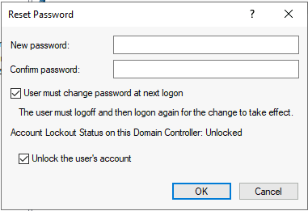
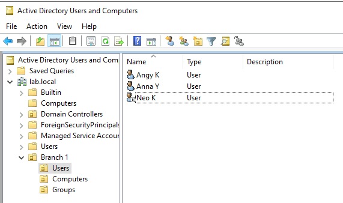
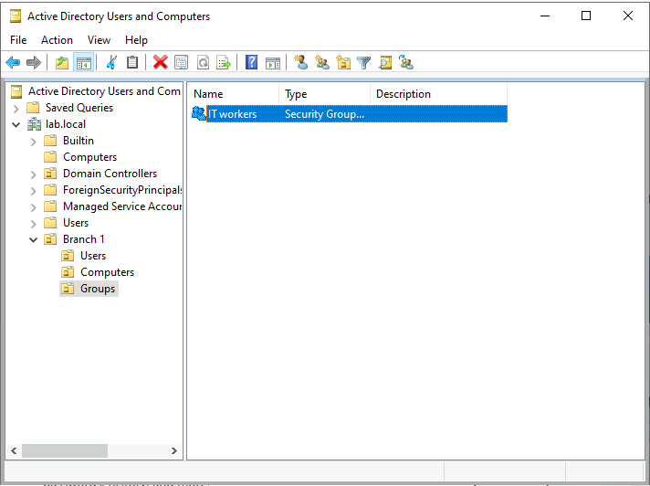
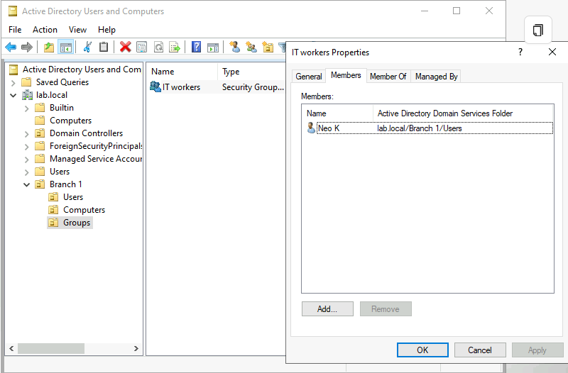
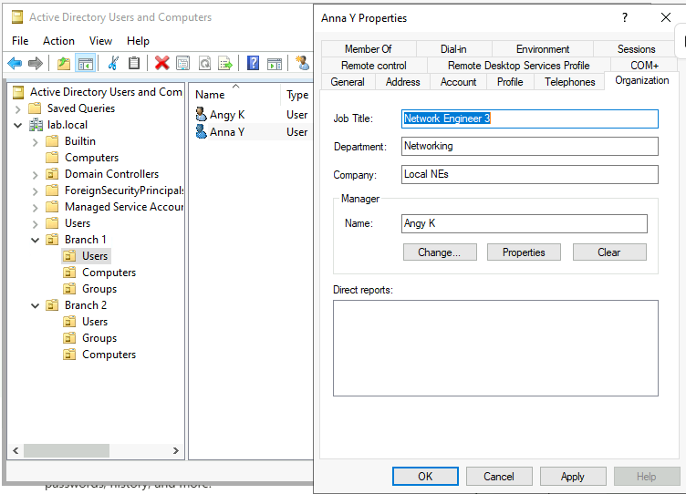
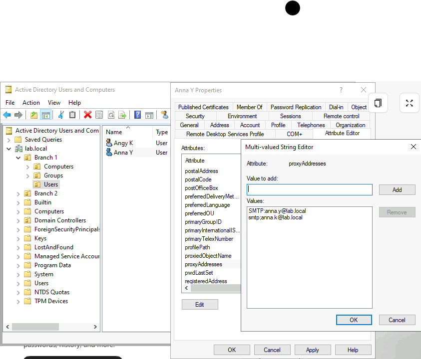

# Active Directory: Users, OUs, and Groups

## Overview
A detailed walkthrough of structuring Active Directory by creating an 
Organizational Unit (OU) hierarchy and organizing Users and Groups within 
the domain.

## Technologies Used
- Active Directory Domain Services (AD DS)
- Active Directory Users and Computers (ADUC)

## Build Process

### 1. Creating the Branch 1 OU

Created a top-level OU named "Branch 1" to simulate an organizational branch. 
Users, Computers, and Groups OUs were structured underneath it.

### 2. Users OU

Created a Users OU under Branch 1 to manage domain user accounts.

### 2-1. Reset the password (Neo.K)

Verify uer and reset the password. 

### 2-2. Lockout Status (Neo.K)

If User'saccount was locked, but still knew password, Unlocked the user's account.

### 2-3. Disabled the User

Disabled the user's account.

### 3. Groups OU (IT workers)

Created a Groups OU under Branch 1 to manage security/distribution groups.

### 3-1. Groups OU: Add Members

Add a member in the Group (IT workers)

### 4. Add a Description in User Properties

Add descriptions in the user's organization tab.

### 4-1. Edit The Email Address in The User's Attribute Editor

Edit the Email Address due to user's Email address has been changed.

## What I Learned
- Learned how OUs help organize and delegate control within Active Directory.
- Practiced structuring a domain in a way that mirrors a real organizational hierarchy.
- Understood how grouping Users, Computers, and Groups under a branch OU 
  simplifies management and permission delegation.
