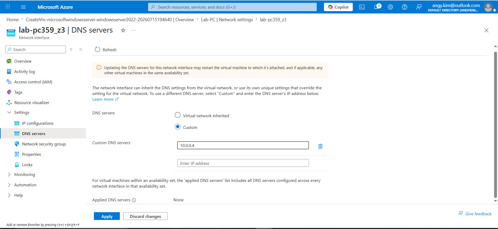

# Joining a PC to Active Directory - Full Domain Setup

## Overview
A hands-on project demonstrating how to join a client machine to an Active 
Directory domain, verifying domain connectivity, and confirming the computer 
object appears correctly within the domain structure.

## Technologies Used
- Windows Server 2022 (Domain Controller)
- Windows 10/11 (Client machine)
- Active Directory Domain Services (AD DS)
- Active Directory Users and Computers (ADUC)

## Build Process

### 1. Configured DNS on the client machine

Set the client's preferred DNS server to the domain controller's IP address, 
which is required for the client to locate the domain.

### 2. Joined the PC to the domain

Changed the computer's domain membership from Workgroup to the domain 
(e.g. lab.local) via System Properties.

### 3. Authenticated with domain credentials

Entered domain administrator credentials to authorize the join request.

### 4. Verified successful domain join

Confirmed the "Welcome to the domain" message and restarted the client machine.

### 5. Verified the computer object in Active Directory

Confirmed the new computer object appeared under the Computers OU in 
Active Directory Users and Computers.

### 6. Logged in with a domain account

Logged into the client machine using a domain user account to confirm 
authentication against the domain controller.

## What I Learned
- Learned how DNS configuration on a client is required before a domain 
  join can succeed.
- Understood the full workflow of joining a Windows machine to an Active 
  Directory domain.
- Practiced verifying domain membership from both the client side and the 
  Active Directory (server) side.
