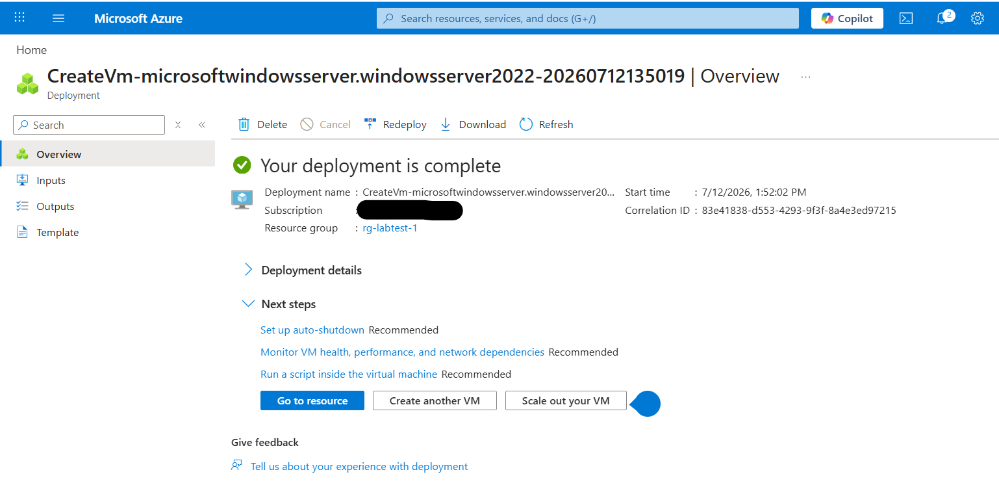
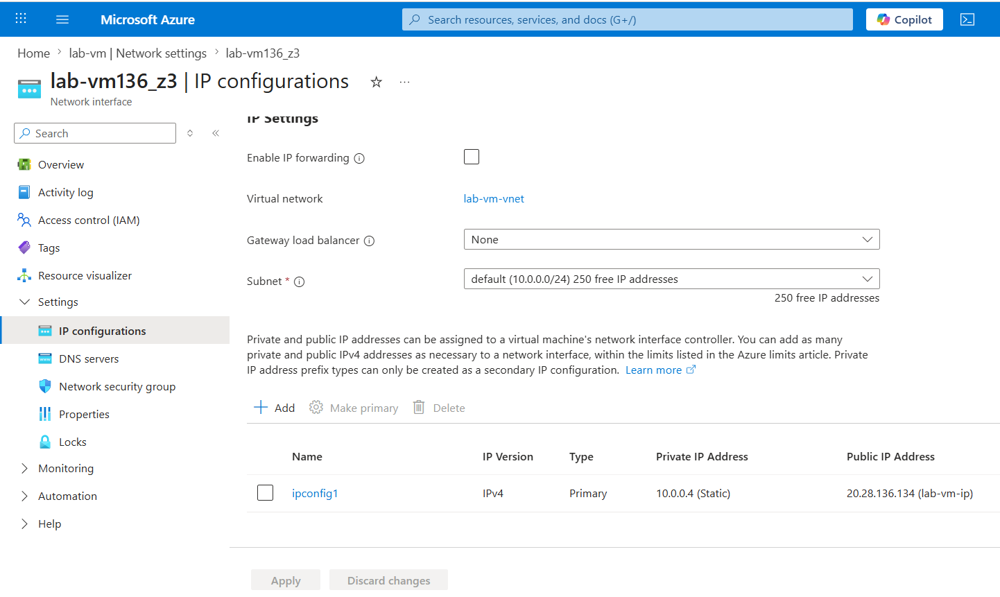
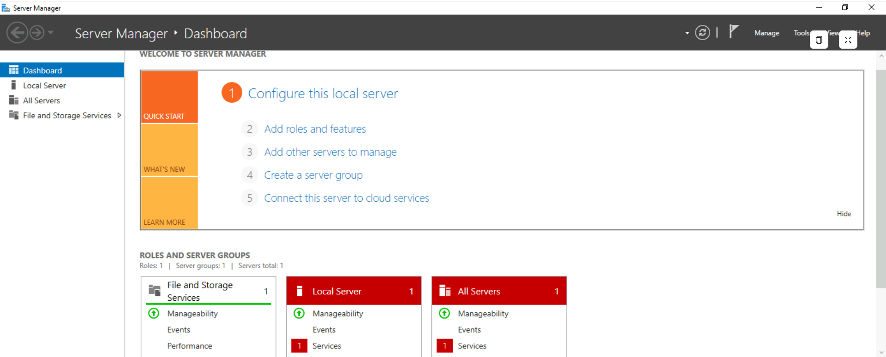
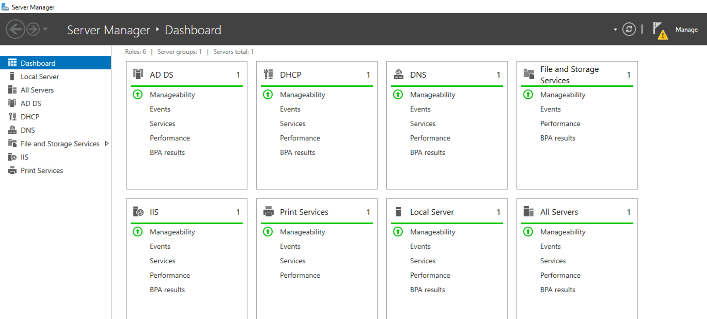

# Azure Bastion & Virtual Machine Project

## Overview
A hands-on project setting up secure remote access to an Azure VM using Azure Bastion, without exposing a public IP.

## Technologies Used
- Azure Virtual Machine (Windows Server 2022)
- Azure Bastion
- Azure Virtual Network (VNet)

## Build Process

### 1. Deployed a Windows Server Virtual Machine

Created the VM using the Standard_D2s_v3 size.

### 2. IP Configurations

Set a static private IP for the domain controller in my lab environment.

### 3. Connect the Windows Server vm through Azure Bastion

Set up Azure Bastion to allow secure connection without exposing a public IP.

### 4. Install roles and features (adds)_Active Directory

## What I Learned
- Learned how Bastion enables secure remote access without a public IP.
- Understood the importance of Network Security Group (NSG) configuration.
